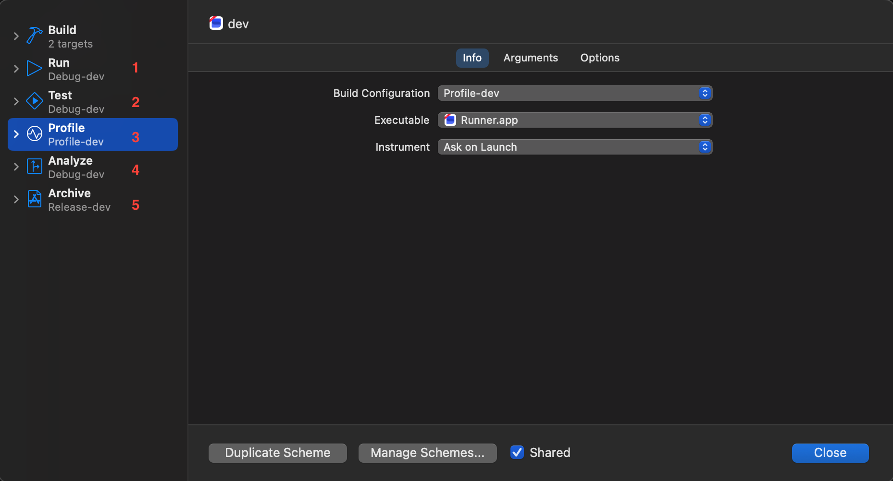
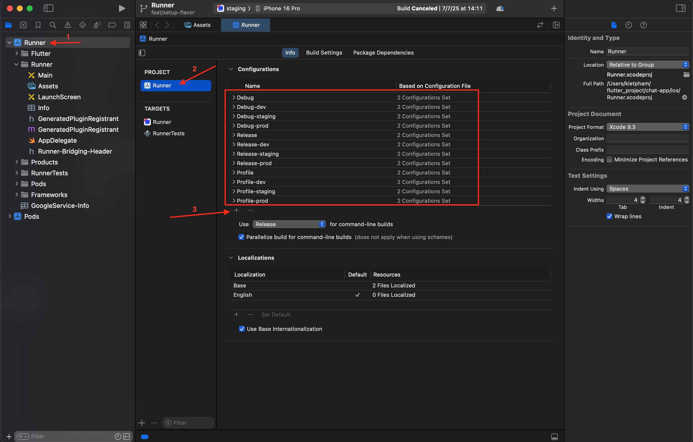
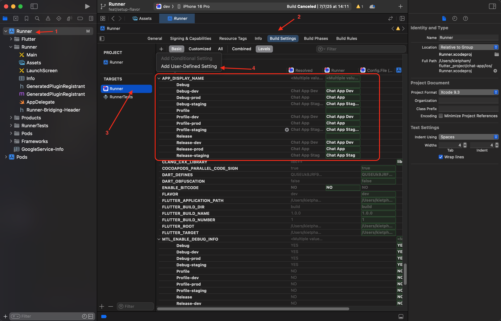
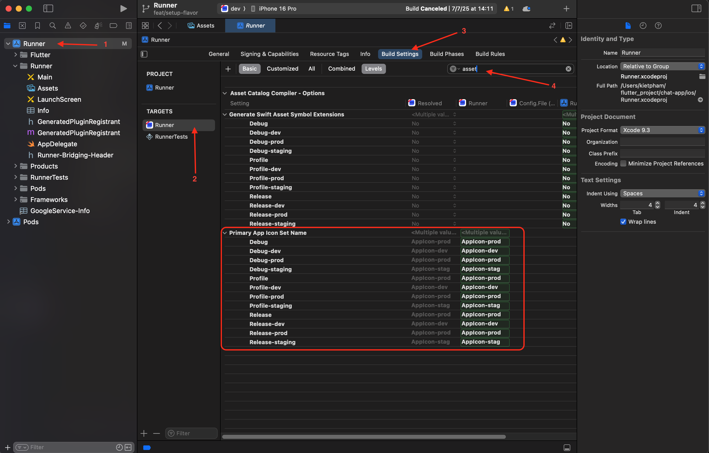

# Flutter Flavors Setup Guide (Android & iOS)

This guide walks you through setting up multiple environments (flavors) for a Flutter project such as `dev`, `stag`, and `prod`.

---

## Introduction to Flavors

* **Purpose**: Use flavors to manage different environments with distinct configurations (e.g., API endpoints, themes).
* **Benefit**: Easily switch between environments while using the same codebase.

---

##  Step 1: Configure Flutter Flavors

1. Create file `flavors/flavor_config.dart`
2. Add the following inside `flavor_config.dart`:

```dart
enum Flavor { dev, stag, prod }

class FlavorConfig {
  final Flavor flavor;
  final String name;
  final String baseUrl;

  static FlavorConfig? _instance;

  FlavorConfig._({
    required this.flavor,
    required this.name,
    required this.baseUrl,
  });

  factory FlavorConfig({
    required Flavor flavor,
    required String name,
    required String baseUrl,
  }) {
    _instance ??= FlavorConfig._(flavor: flavor, name: name, baseUrl: baseUrl);
    return _instance!;
  }

  static FlavorConfig get instance {
    if (_instance == null) {
      throw Exception('Not initialized flavor config!');
    }
    return _instance!;
  }

  static bool isDev(String env) => env == Flavor.dev.name;

  static bool isStag(String env) => env == Flavor.stag.name;

  static bool isProd(String env) => env == Flavor.prod.name;
}
```

3. Create file `main_common.dart`:
4. Add the following inside `main_common.dart`:
```dart
void mainCommon({
  required Flavor flavor,
  required String baseUrl,
  required String name,
}) {
  FlavorConfig(flavor: flavor, baseUrl: baseUrl, name: name);
  runApp(MyApp());
}
```

5. Create 3 file: `main_dev.dart`, `main_staging.dart`, `main_prod.dart`
6. Add the code below into the three newly created files, and update the `flavor` value to match the corresponding environment:
```dart
Future<void> main() async {
  mainCommon(flavor: Flavor.staging, baseUrl: '', name: CAEnv.env);
}
```

---

##  Step 2: Configure Android Flavors

1. Open `android/app/build.gradle.kts`
2. Add the following inside `android` block:

```gradle
    flavorDimensions += "env"

    productFlavors {
        create("dev") {
            dimension = "env"
            // uncomment the following line if you want to add a suffix to the applicationId
            // applicationIdSuffix = ".dev"
            versionNameSuffix = "-dev"
            resValue("string", "app_name", "Chat App (DEV)")
        }
        create("stag") {
            dimension = "env"
            // uncomment the following line if you want to add a suffix to the applicationId
            // applicationIdSuffix = ".stag"
            versionNameSuffix = "-stag"
            resValue("string", "app_name", "Chat App (STAG)")
        }
        create("prod") {
            dimension = "env"
            resValue("string", "app_name", "Chat App")
        }
    }
```

3. Sync Gradle.
4. Open `android/app/src/main/AndroidManifest.xml`
5. Find `android:label="default name"` change to `android:label="@string/app_name"`

---

##  Step 3: Configure iOS Flavors

1. Open `ios/Runner.xcodeproj` in Xcode.

2. Create new Schemes:

   * `Product > Scheme > Manage Schemes`
   * Duplicate scheme for each flavor: Dev, Staging, Prod
   * Assign correct build configuration to each scheme
   * 

3. Duplicate the build configurations:

   * Select project > Info tab
   * Duplicate `Debug` → rename to `Debug-dev`, `Debug-staging` and `Debug-prod`
   * Do the same for `Profile` and `Release`
   * 

4. Add User-Defined Setting

    * Open `Runner`>`Target`>`Runner`>`Build Settings`>Button`+`>`Add User-Defined Setting`
    * Create `APP_DISPLAY_NAME`
    * 

---

## Step 4: Setup Flavor App Icon
1. Create 3 file: `flutter_launcher_icons-dev.yaml`, `flutter_launcher_icons-stag.yaml`, `flutter_launcher_icons-prod.yaml`

2. Add the following inside the 3 files just created and update the `image_path` value to match the corresponding environment
```yaml
flutter_launcher_icons:
  android: true
  ios: true
  image_path: "assets/images/app_icon_dev.png"
```
3. Remove default app icon
   * Android:
     * Open: `android/app/src/main/res/`
     * Delete if the folder exists
       * `mipmap-hdpi`
       * `mipmap-mdpi`
       * `mipmap-xhdpi`
       * `mipmap-xxhdpi`
       * `mipmap-xxxhdpi`
   * iOS:
     * Open: `ios/Runner/Assets.xcassets/`
     * Delete if the folder exists
       * `AppIcon.appiconset`
4. Setup AppIcon(`Only iOS`)
   

## 🚀 Step 5: Build & Test Flavors

* **Android**:

```bash
flutter build apk --flavor dev -t lib/main_dev.dart
```

* **iOS**:

```bash
flutter build ios --flavor dev -t lib/main_dev.dart
```
